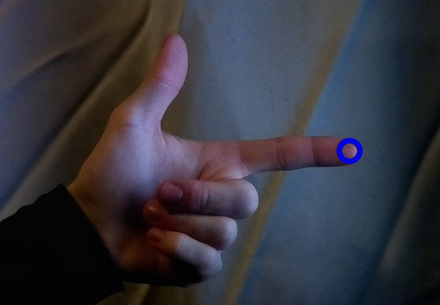
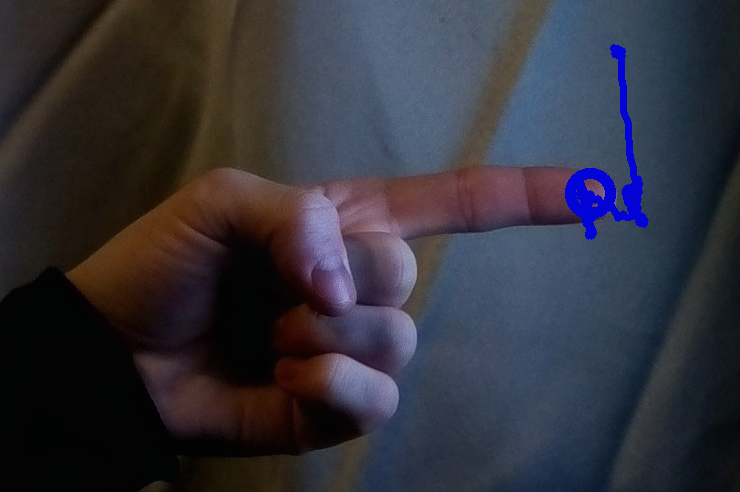

# mp-gestures
Experiments on gesture recognition using mediapipe-hands library.

# Denne branchen
Kan tegne med bruk av pekefingeren

Vise malekost ved å peke med tommel opp

Tenge ved å bare peke (ta tommel ned)

## Installation
Currently this repo has only been tested with python 3.7.9.
Following the official instructions for installing [mediapipe](https://google.github.io/mediapipe/getting_started/python.html)
should cover all dependencies for this project.

 
